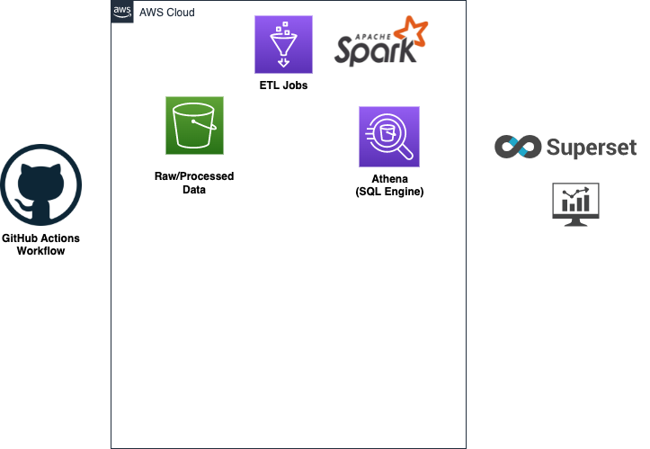

# Analyzing CI Performance with CIAnalyzer

Code repo for blog post [Analyzing CI performance with CIAnalyzer, Spark, Athena and Superset](https://medium.com/@gaius4888/analyzing-ci-performance-with-cianalyzer-spark-athena-and-superset-7a5bc04)

The `terraform` folder contains Terraform code to create AWS resources for data storage and processing

The `etl_job` folder contains Glue script for ETL jobs
